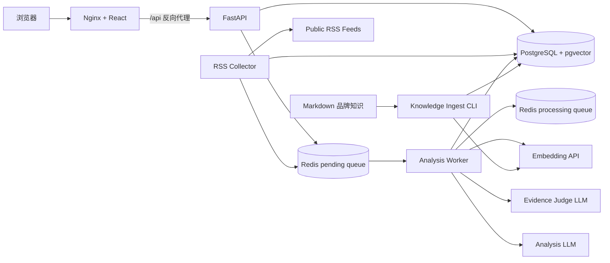

# BrandPulse

BrandPulse 是一个 AI 品牌舆情采集、知识增强分析与可视化平台。系统将 RSS 采集、内容去重、异步任务队列、品牌知识检索、证据充分性审核、结构化大模型分析、风险聚合和 Web 展示串成一条可运行的端到端链路。

> 当前版本：`v0.2`。核心 MVP 与本地 pgvector RAG 链路已经完成；OpenClaw 自动化、消息预警和更多文档清洗能力属于后续路线图。

## 已实现能力

- 品牌创建、列表和详情查询
- 手工录入、RSS Feed 批量导入及持久化数据源管理
- 独立 Collector 定时采集，支持立即采集、启停、采集周期、单次文章上限和错误记录
- RSS 新文章自动创建持久化分析任务并进入 Redis 队列
- RSS/HTML 基础清洗：优先读取 `content:encoded`，移除标签、脚本、样式并规范空白与 HTML 实体
- 基于 SHA-256 内容指纹的文章去重
- OpenAI-compatible 模型 Provider，可切换兼容模型服务
- Pydantic 结构化输出：情感、风险等级、风险类型、摘要与处置建议
- PostgreSQL + pgvector 品牌知识库，支持 Markdown 按章节分块、1024 维向量入库和品牌隔离检索
- OpenAI-compatible Embedding Provider，可切换兼容的嵌入模型服务
- 两阶段 RAG：pgvector 召回候选知识，再由证据审核模型判断证据是否足以支持当前事件
- 只向分析模型注入审核通过的知识块，范围外问题不强行使用内部知识
- 分析结果持久化知识引用、相似度、检索模型、审核模型和证据判断原因
- Redis 可靠队列：pending/processing 双队列、任务确认、失败重试和启动恢复
- PostgreSQL 持久化任务状态与分析结果
- 应用层复用与 PostgreSQL 部分唯一索引，防止同一文章重复创建活动任务
- 品牌风险概览、高风险文章列表和近 30 天风险趋势
- React + TypeScript 管理台：文章录入、自适应异步进度轮询、历史文章补分析、结果展开和 RAG 引用展示
- Docker Compose 一键运行前端、API、worker、迁移、PostgreSQL 和 Redis
- 可关联 worker 日志，记录 `job_id`、`article_id`、尝试次数和模型名称

## 系统架构



异步分析流程：

```text
POST /articles/{id}/analyze/async
  → PostgreSQL 创建 analysis_job
  → Redis pending 队列
  → worker 使用 LMOVE 原子领取到 processing 队列
  → 将文章标题和正文构造成知识查询并生成查询向量
  → pgvector 在对应品牌内召回 Top 3 候选知识块
  → Evidence Judge 审核证据充分性并选出真正支持事件的文本块
  → 仅将通过审核的知识注入 Analysis LLM
  → 校验结构化输出并保存分析结果、引用链路，任务标记 completed
  → 从 processing 队列确认删除
  → 前端轮询任务并刷新仪表盘
```

worker 异常退出时，processing 队列中的任务会在下次启动时恢复到 pending 队列。该机制提供 at-least-once 处理语义；分析结果按文章更新，避免产生多份结果记录。未配置完整 RAG Provider 时，系统仍可完成普通舆情分析，但不会使用品牌内部知识。

自动采集流程：

```text
feed_sources 保存 RSS 地址、启停状态和采集周期
  → Collector 每轮查询到期的数据源
  → 获取并解析公开 RSS XML
  → 优先读取完整正文并执行 HTML 文本化清洗
  → 只处理按时间排序的前 N 篇（默认 5 篇，范围 1–50）
  → SHA-256 内容指纹去重并保存新文章
  → PostgreSQL 创建 queued 分析任务
  → 队列协调器补发尚未进入 Redis 的持久化任务
  → Analysis Worker 完成模型分析
```

数据库中的 `analysis_jobs` 同时承担持久化任务记录的作用。Collector 会检查仍为 `queued`、但不在 Redis pending/processing 队列中的任务并重新分发，从而覆盖数据库提交后 Redis 短暂不可用的情况。

每个 RSS 数据源通过 `max_articles_per_collection` 限制单轮处理规模，默认值为 5。即使上游 Feed 一次返回 99 篇，Collector 也只会让前 5 篇进入去重、入库和分析队列；采集响应会分别返回发现数、实际处理数和因上限忽略数。前端在存在活动任务时每 5 秒刷新，空闲时每 30 秒巡检，发现新结果后同步更新风险概览和图表。

## 技术栈

| 层 | 技术 |
| --- | --- |
| 后端 | Python 3.11–3.13、FastAPI、Pydantic v2 |
| 数据访问 | SQLAlchemy 2 Async、asyncpg、Alembic |
| 数据与队列 | PostgreSQL 16、pgvector、Redis 7 |
| AI | OpenAI-compatible Chat/Embedding API、结构化输出、证据充分性审核、可插拔 Provider |
| 前端 | React 19、TypeScript 6、Vite 8、Recharts |
| 部署 | Docker、Docker Compose、Nginx 多阶段构建 |
| 质量 | pytest、pytest-asyncio、Ruff、ESLint、TypeScript |

## 快速启动

准备 Docker Desktop，然后在项目根目录执行：

```bash
cp .env.example .env
docker compose up -d --build
docker compose ps -a
```

正常状态：

- `frontend`、`api`、`worker`、`collector`、`postgres`、`redis` 为 `Up`
- `migrate` 为 `Exited (0)`，表示迁移已成功执行

访问地址：

- Web 控制台：<http://localhost:3000>
- Swagger API：<http://localhost:8000/docs>
- 健康检查：<http://localhost:8000/api/v1/health>

查看运行日志：

```bash
docker compose logs -f api worker collector
```

停止服务并保留数据卷：

```bash
docker compose down
```

不要使用 `docker compose down -v`，除非确定要删除 PostgreSQL 和 Redis 数据。

## 模型服务配置

未配置 `LLM_API_KEY` 和 `LLM_MODEL` 时，项目使用本地规则 Provider，便于开发和自动化测试。要启用本地 pgvector RAG，还必须配置兼容的 Embedding API。修改 `.env`：

```dotenv
LLM_API_KEY=your-api-key
LLM_BASE_URL=https://provider.example.com/v1
LLM_MODEL=provider/model-name
LLM_TIMEOUT_SECONDS=120
LLM_MAX_RETRIES=1

EMBEDDING_API_KEY=your-embedding-api-key
EMBEDDING_BASE_URL=https://provider.example.com/v1
EMBEDDING_MODEL=text-embedding-v4
EMBEDDING_DIMENSIONS=1024
EMBEDDING_TIMEOUT_SECONDS=30

RSS_REQUEST_TIMEOUT_SECONDS=30
COLLECTOR_POLL_SECONDS=10
```

- `LLM_TIMEOUT_SECONDS`：单次模型 HTTP 请求的最大等待时间
- `LLM_MAX_RETRIES`：SDK 在一次 worker 任务尝试中的额外重试次数
- `EMBEDDING_*`：本地 pgvector 知识入库和查询向量使用的模型配置
- 当前 `knowledge_chunks.embedding` 固定为 1024 维，更换嵌入模型时必须保证输出维度一致
- Evidence Judge 当前复用 `LLM_*` 配置，与最终舆情分析模型使用同一个兼容模型服务
- worker 在任务层最多尝试 3 次，最终状态和错误信息写入 PostgreSQL
- `RSS_REQUEST_TIMEOUT_SECONDS`：单次 RSS HTTP 请求超时
- `COLLECTOR_POLL_SECONDS`：Collector 检查到期数据源的频率；每个数据源自身的采集周期由数据库配置

修改 `.env` 后需要重新创建容器，单纯执行 `restart` 不会重新读取环境变量：

```bash
docker compose up -d --no-deps --force-recreate api worker collector
```

不同兼容服务对结构化输出的支持可能不同，切换服务后应完成一次端到端验证。不要提交包含真实密钥的 `.env`。

一次启用 RAG 的文章分析通常包含 1 次 Embedding 请求和 2 次 Chat 请求：证据充分性审核一次、最终舆情分析一次。因此，免费模型服务的限流和超时可能比普通单次分析更明显。

## 本地 pgvector 知识库

知识库按 `brand_id` 隔离。开始前先通过 Web 或 API 创建对应品牌，并确认 Docker 服务已经启动。以下命令在项目根目录执行；本机 `.env` 中的 `DATABASE_URL` 应连接 `localhost:5432`。

先验证嵌入服务能返回 1024 维归一化向量：

```bash
uv run python -m app.cli.verify_embedding
```

将演示 Markdown 文档按章节分块、向量化并写入 pgvector：

```bash
uv run python -m app.cli.ingest_knowledge \
  --brand BlueCurrent \
  docs/knowledge/bluecurrent_product_and_response_policy.md \
  docs/knowledge/bluecurrent_p0_response_card.md \
  docs/knowledge/bluecurrent_seal07_emergency_card.md
```

同一品牌和文件名再次入库时会替换该来源原有文本块，便于更新知识版本。当前知识入库入口针对 UTF-8 Markdown，并按标题章节分块。文章采集链路已经具备 RSS/HTML 基础文本化，但它与品牌知识文档入库是两条独立链路。

执行向量检索：

```bash
uv run python -m app.cli.search_knowledge \
  --brand BlueCurrent \
  --limit 3 \
  "设备报出 SEAL-07 后，用户首先应该怎么做？"
```

执行“向量召回 + 大模型证据审核”：

```bash
uv run python -m app.cli.assess_knowledge \
  --brand BlueCurrent \
  --limit 3 \
  "BlueCurrent 手机电池的保修期是多少？"
```

运行可复现的纯检索评测：

```bash
uv run python -m app.cli.evaluate_knowledge \
  --brand BlueCurrent \
  --limit 3 \
  --threshold 0
```

评测集、实验过程和结果见 [`docs/evaluation/pgvector_retrieval_evaluation.md`](docs/evaluation/pgvector_retrieval_evaluation.md)。

当前小规模演示评测包含 8 个可回答问题和 2 个范围外问题。新增自包含的 `SEAL-07` 知识卡后，纯向量检索 Top 1 命中率为 `7/8`，Top 3 命中率为 `8/8`；纯相似度无法稳定拒绝范围外问题。加入 Evidence Judge 后，已验证的 Q2、Q9、Q10 三条冒烟用例均符合预期，其中两个范围外问题均被拒绝。以上仅是小规模可复现实验结果，不代表生产环境准确率。

## 主要 API

| 方法 | 路径 | 说明 |
| --- | --- | --- |
| `POST` | `/api/v1/brands` | 创建品牌 |
| `GET` | `/api/v1/brands` | 查询品牌列表 |
| `POST` | `/api/v1/articles` | 手工创建文章 |
| `POST` | `/api/v1/articles/import/rss` | 从 RSS 导入文章 |
| `POST` | `/api/v1/feed-sources` | 保存 RSS 数据源 |
| `GET` | `/api/v1/feed-sources?brand_id=...` | 查询品牌 RSS 数据源 |
| `PATCH` | `/api/v1/feed-sources/{id}` | 修改启停状态、名称、地址、采集周期或单次文章上限 |
| `POST` | `/api/v1/feed-sources/{id}/collect` | 立即采集并自动提交新文章分析 |
| `GET` | `/api/v1/articles?brand_id=...` | 查询品牌文章 |
| `POST` | `/api/v1/articles/{id}/analyze/async` | 创建或复用异步分析任务 |
| `GET` | `/api/v1/analysis-jobs/{job_id}` | 查询任务状态 |
| `GET` | `/api/v1/articles/{id}/analysis` | 查询分析结果 |
| `GET` | `/api/v1/articles/{id}/analysis/status` | 查询未提交、排队、处理中、完成或失败状态 |
| `GET` | `/api/v1/brands/{id}/risk-summary` | 品牌风险概览 |
| `GET` | `/api/v1/brands/{id}/high-risk-articles` | 高风险文章 |
| `GET` | `/api/v1/brands/{id}/risk-trend` | 风险趋势 |

完整请求和响应 Schema 以 Swagger 为准。

## 本地开发与检查

安装 Python 依赖：

```bash
uv sync --dev
```

运行后端检查：

```bash
uv run ruff check .
uv run ruff format --check .
uv run pytest -q
```

当前后端测试覆盖 API、Schema、RSS 解析、数据源持久化、自动入队、内容去重、报表查询、队列操作、worker 重试、知识分块、向量检索、证据审核、RAG 持久化和数据库约束。

运行前端检查：

```bash
cd frontend
npm ci
npm run lint
npm run build
```

## 目录结构

```text
brandpulse/
├── app/
│   ├── api/routes/       # FastAPI 路由
│   ├── core/             # 配置、Redis 与 HTTP 依赖
│   ├── db/               # 异步数据库会话
│   ├── models/           # SQLAlchemy 模型
│   ├── providers/        # 分析、Embedding 与 Evidence Provider
│   ├── schemas/          # Pydantic 输入输出模型
│   ├── services/         # 采集、队列、知识检索、分析与报表逻辑
│   └── workers/          # 异步分析 worker
├── docs/
│   ├── knowledge/        # 演示品牌知识文档
│   └── evaluation/       # pgvector 检索评测集与实验记录
├── frontend/             # React 管理台与 Nginx 配置
├── migrations/           # Alembic 数据库迁移
├── tests/                # 后端自动化测试
└── docker-compose.yml    # 本地完整运行环境
```

## 可靠性设计

- 数据库迁移：Alembic 只执行尚未应用的版本
- 内容幂等：文章正文 SHA-256 唯一约束
- 内容规范化：手工 HTML 和 RSS 正文在计算指纹、存储及分析前使用同一套基础清洗规则
- 流量保护：每个 RSS 数据源限制单轮处理和自动入队的文章数量
- 任务幂等：接口复用活动任务，数据库部分唯一索引处理并发竞态
- 队列可靠性：pending/processing 双队列和 worker 启动恢复
- 分层重试：SDK 请求级重试与 worker 任务级重试
- 结果校验：所有模型输出通过 Pydantic Schema 验证后才持久化
- RAG 防幻觉：向量召回后独立审核证据充分性，仅注入审核通过的文本块
- 引用追踪：记录知识来源、章节、相似度、Embedding 模型、Evidence 模型和审核原因
- 可观测性：任务日志包含关联 ID、尝试次数、Provider、知识使用状态和最终状态

## 后续路线图

- 增加 TXT/PDF 知识入库，以及网页正文抽取、模板噪声过滤和更完整的清洗评测
- 对比本地 pgvector 与 RAGFlow 等外部知识库方案
- 使用 OpenClaw/Agent 自动生成日报并推送高风险预警
- 增加网页数据源与 CSV 导入、重排序和更大规模 RAG 评测
- 增加鉴权、角色权限和生产环境部署配置
- 增加前端组件测试、端到端测试和性能基准

## 数据与安全原则

- 只采集公开页面、RSS、官方 API 或明确授权的数据
- 不提交真实 API Key、账号密码或含敏感信息的 `.env`
- 简历中的准确率、性能与规模指标只使用可复现的真实测试结果
- AI 输出用于辅助研判，不替代人工审核和正式业务决策
