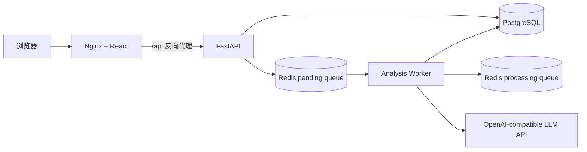

# BrandPulse

BrandPulse 是一个 AI 品牌舆情采集、风险分析与可视化平台。系统将文章采集、内容去重、异步任务队列、结构化大模型分析、风险聚合和 Web 展示串成一条可运行的端到端链路。

> 当前版本：`v0.1`。核心 MVP 已完成；RAGFlow 知识库、OpenClaw 自动化和消息预警属于后续路线图。

## 已实现能力

- 品牌创建、列表和详情查询
- 手工录入及 RSS Feed 批量导入
- 基于 SHA-256 内容指纹的文章去重
- OpenAI-compatible 模型 Provider，可切换兼容模型服务
- Pydantic 结构化输出：情感、风险等级、风险类型、摘要与处置建议
- Redis 可靠队列：pending/processing 双队列、任务确认、失败重试和启动恢复
- PostgreSQL 持久化任务状态与分析结果
- 应用层复用与 PostgreSQL 部分唯一索引，防止同一文章重复创建活动任务
- 品牌风险概览、高风险文章列表和近 30 天风险趋势
- React + TypeScript 管理台：文章录入、异步进度轮询、历史文章补分析和结果展开
- Docker Compose 一键运行前端、API、worker、迁移、PostgreSQL 和 Redis
- 可关联 worker 日志，记录 `job_id`、`article_id`、尝试次数和模型名称

## 系统架构



异步分析流程：

```text
POST /articles/{id}/analyze/async
  → PostgreSQL 创建 analysis_job
  → Redis pending 队列
  → worker 使用 LMOVE 原子领取到 processing 队列
  → 调用模型并校验结构化输出
  → 保存 analysis_result，任务标记 completed
  → 从 processing 队列确认删除
  → 前端轮询任务并刷新仪表盘
```

worker 异常退出时，processing 队列中的任务会在下次启动时恢复到 pending 队列。该机制提供 at-least-once 处理语义；分析结果按文章更新，避免产生多份结果记录。

## 技术栈

| 层 | 技术 |
| --- | --- |
| 后端 | Python 3.11–3.13、FastAPI、Pydantic v2 |
| 数据访问 | SQLAlchemy 2 Async、asyncpg、Alembic |
| 数据与队列 | PostgreSQL 16、Redis 7 |
| AI | OpenAI-compatible SDK、结构化输出、可插拔 Provider |
| 前端 | React 19、TypeScript 6、Vite 8、Recharts |
| 部署 | Docker、Docker Compose、Nginx 多阶段构建 |
| 质量 | pytest、pytest-asyncio、Ruff、ESLint、TypeScript |

## 快速启动

准备 Docker Desktop，然后在项目根目录执行：

```bash
cp .env.example .env
docker compose up -d --build
docker compose ps -a
```

正常状态：

- `frontend`、`api`、`worker`、`postgres`、`redis` 为 `Up`
- `migrate` 为 `Exited (0)`，表示迁移已成功执行

访问地址：

- Web 控制台：<http://localhost:3000>
- Swagger API：<http://localhost:8000/docs>
- 健康检查：<http://localhost:8000/api/v1/health>

查看运行日志：

```bash
docker compose logs -f api worker
```

停止服务并保留数据卷：

```bash
docker compose down
```

不要使用 `docker compose down -v`，除非确定要删除 PostgreSQL 和 Redis 数据。

## 模型服务配置

未配置 `LLM_API_KEY` 和 `LLM_MODEL` 时，项目使用本地规则 Provider，便于开发和自动化测试。接入兼容模型服务时修改 `.env`：

```dotenv
LLM_API_KEY=your-api-key
LLM_BASE_URL=https://provider.example.com/v1
LLM_MODEL=provider/model-name
LLM_TIMEOUT_SECONDS=120
LLM_MAX_RETRIES=1
```

- `LLM_TIMEOUT_SECONDS`：单次模型 HTTP 请求的最大等待时间
- `LLM_MAX_RETRIES`：SDK 在一次 worker 任务尝试中的额外重试次数
- worker 在任务层最多尝试 3 次，最终状态和错误信息写入 PostgreSQL

修改 `.env` 后需要重新创建容器，单纯执行 `restart` 不会重新读取环境变量：

```bash
docker compose up -d --no-deps --force-recreate api worker
```

不同兼容服务对结构化输出的支持可能不同，切换服务后应完成一次端到端验证。不要提交包含真实密钥的 `.env`。

## 主要 API

| 方法 | 路径 | 说明 |
| --- | --- | --- |
| `POST` | `/api/v1/brands` | 创建品牌 |
| `GET` | `/api/v1/brands` | 查询品牌列表 |
| `POST` | `/api/v1/articles` | 手工创建文章 |
| `POST` | `/api/v1/articles/import/rss` | 从 RSS 导入文章 |
| `GET` | `/api/v1/articles?brand_id=...` | 查询品牌文章 |
| `POST` | `/api/v1/articles/{id}/analyze/async` | 创建或复用异步分析任务 |
| `GET` | `/api/v1/analysis-jobs/{job_id}` | 查询任务状态 |
| `GET` | `/api/v1/articles/{id}/analysis` | 查询分析结果 |
| `GET` | `/api/v1/brands/{id}/risk-summary` | 品牌风险概览 |
| `GET` | `/api/v1/brands/{id}/high-risk-articles` | 高风险文章 |
| `GET` | `/api/v1/brands/{id}/risk-trend` | 风险趋势 |

完整请求和响应 Schema 以 Swagger 为准。

## 本地开发与检查

安装 Python 依赖：

```bash
uv sync --dev
```

运行后端检查：

```bash
uv run ruff check .
uv run ruff format --check .
uv run pytest -q
```

当前后端测试集包含 39 个测试，覆盖 API、Schema、RSS 解析、内容去重、报表查询、队列操作、worker 重试、持久化和数据库约束。

运行前端检查：

```bash
cd frontend
npm ci
npm run lint
npm run build
```

## 目录结构

```text
brandpulse/
├── app/
│   ├── api/routes/       # FastAPI 路由
│   ├── core/             # 配置、Redis 与 HTTP 依赖
│   ├── db/               # 异步数据库会话
│   ├── models/           # SQLAlchemy 模型
│   ├── providers/        # 可插拔分析 Provider
│   ├── schemas/          # Pydantic 输入输出模型
│   ├── services/         # 采集、队列、分析与报表逻辑
│   └── workers/          # 异步分析 worker
├── frontend/             # React 管理台与 Nginx 配置
├── migrations/           # Alembic 数据库迁移
├── tests/                # 后端自动化测试
└── docker-compose.yml    # 本地完整运行环境
```

## 可靠性设计

- 数据库迁移：Alembic 只执行尚未应用的版本
- 内容幂等：文章正文 SHA-256 唯一约束
- 任务幂等：接口复用活动任务，数据库部分唯一索引处理并发竞态
- 队列可靠性：pending/processing 双队列和 worker 启动恢复
- 分层重试：SDK 请求级重试与 worker 任务级重试
- 结果校验：所有模型输出通过 Pydantic Schema 验证后才持久化
- 可观测性：任务日志包含关联 ID、尝试次数、Provider 和最终状态

## 后续路线图

- 接入 RAGFlow 品牌知识库，为处置建议补充企业资料与引用依据
- 使用 OpenClaw/Agent 自动生成日报并推送高风险预警
- 增加定时采集、网页数据源与 CSV 导入
- 增加鉴权、角色权限和生产环境部署配置
- 增加前端组件测试、端到端测试和性能基准

## 数据与安全原则

- 只采集公开页面、RSS、官方 API 或明确授权的数据
- 不提交真实 API Key、账号密码或含敏感信息的 `.env`
- 简历中的准确率、性能与规模指标只使用可复现的真实测试结果
- AI 输出用于辅助研判，不替代人工审核和正式业务决策
